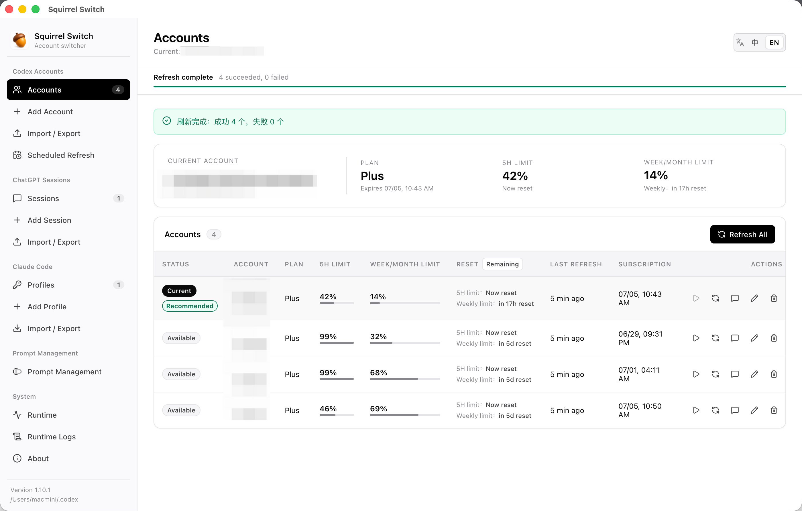
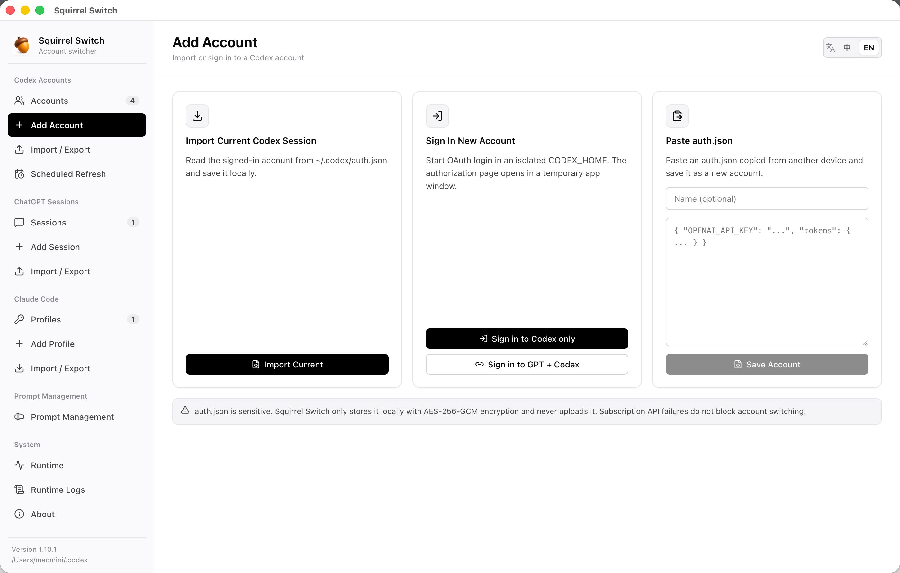
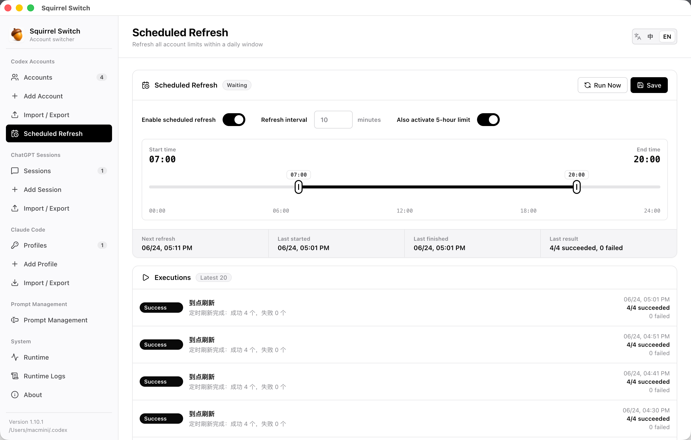
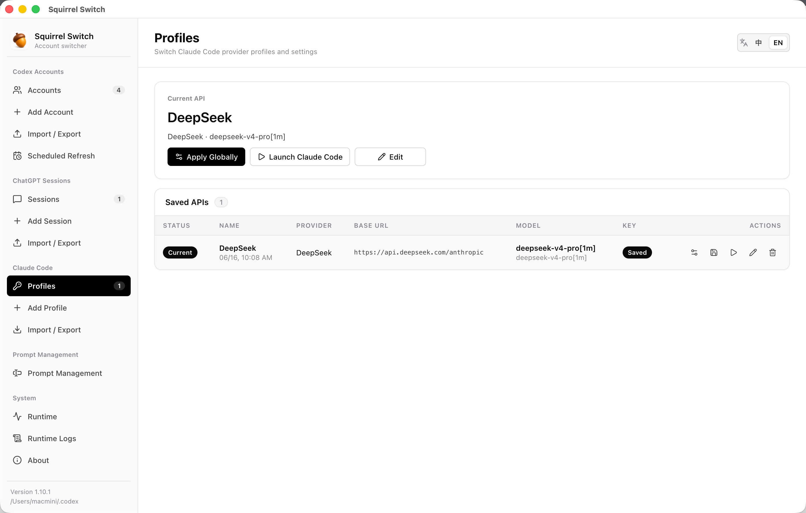
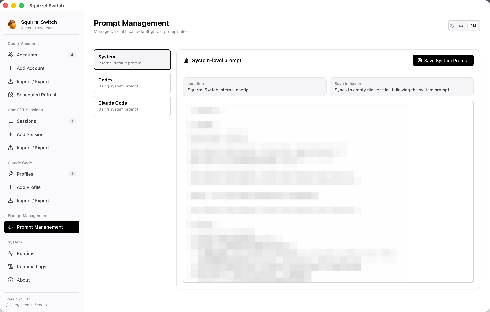

# Squirrel Switch

[English](README.md)

Squirrel Switch 是一个本地 AI 开发工具多账号切换助手。当前重点支持 Codex 登录态管理：加密保存多个账号、一键切换、查看 5 小时与周/月限额，并支持跨 Mac 账号迁移。

## 功能亮点

- 本地优先：凭据仅保存在本机，并使用 AES-256-GCM 加密。
- Codex 账号切换：原子写入 `~/.codex/auth.json`，并可重启正在运行的 Codex.app。
- 账号状态视图：展示限额窗口、可用时的订阅信息、刷新状态和推荐账号。
- 定时刷新：在每日时间区间内刷新全部账号。
- Claude Code 配置切换：管理 provider profile，并应用到用户级或项目级 settings。
- 提示词管理：编辑本机 AI 工具的默认全局提示词文件。
- 中英双语界面：内置语言切换。

## 截图

### Codex 账号



### 添加 Codex 账号



### 定时刷新



### Claude Code 配置



### 提示词管理



## 安装与运行

环境要求：

- Node.js 22+
- Corepack
- 通过 Corepack 使用 pnpm
- 当前桌面端体验优先面向 macOS

```bash
corepack pnpm install
corepack pnpm dev
```

默认服务与路径：

- 服务端：`http://127.0.0.1:3210`
- 前端开发服务：`http://127.0.0.1:5173`
- 本地数据库：`~/.squirrel-switch/squirrel-switch.sqlite`
- 主密钥：优先保存到 macOS Keychain，失败时回退到 `~/.squirrel-switch/master-key`

## 桌面应用

```bash
corepack pnpm desktop
```

该命令会构建 Web 与 Server，启动 Electron，并拉起本地 Fastify 服务。如果 `3210` 被占用，会自动尝试后续端口。

## 打包

macOS：

```bash
corepack pnpm package:mac
```

只生成 `.app`：

```bash
corepack pnpm package:mac:app
```

Windows：

```bash
corepack pnpm package:win
```

当前 macOS 打包脚本使用本地 ad-hoc 签名，可保证 bundle 结构和代码签名自洽，但不等同于 Developer ID 签名和 notarization。面向他人稳定分发时，需要使用 Developer ID Application 证书签名并提交 Apple notarization。

## 安全与隐私

Squirrel Switch 会处理敏感登录态文件。发布 release 或接收用户反馈前，请先阅读 [SECURITY.md](SECURITY.md)。

重要说明：

- 不要提交真实 `auth.json`、API key、数据库、日志或备份文件。
- 账号备份包含可直接登录的凭据，只应用于自己的设备迁移。
- 运行日志不应包含 access token、refresh token、id token、完整 `auth.json` 或完整原始接口响应。

## 项目结构

```text
apps/
  desktop/   Electron 桌面壳
  server/    本地 Fastify API 与持久化
  web/       React 前端界面
packages/
  shared/    共享类型与版本元数据
scripts/     构建与打包脚本
docs/        设计文档
```

## 开发

```bash
corepack pnpm typecheck
corepack pnpm lint
corepack pnpm build
```

## 贡献

欢迎提交 issue 和 pull request。请先阅读 [CONTRIBUTING.md](CONTRIBUTING.md)。

## 支持

如果这个项目对你有帮助，欢迎点一个 star。

捐赠入口可以后续补充，例如 PayPal、GitHub Sponsors 或微信收款码；建议定位为支持维护，而不是付费解锁。

## License

[GNU General Public License v3.0 or later](LICENSE)
